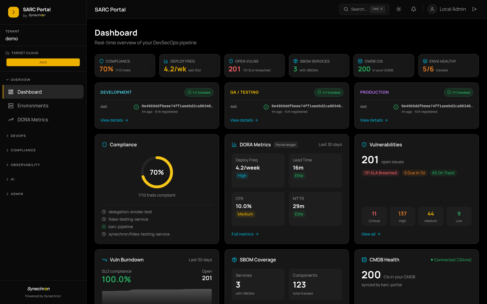

Featured projects with full architecture write-ups, screenshots, and the engineering decisions behind each one.

The common thread across all of them: **self-hosted, auditable, and built for environments where "just trust the vendor" isn't an answer** — regulated banks, air-gapped networks, and one very over-engineered homelab.

## Featured

### [Synechron ARC — Multi-Cloud Compliance Pipeline](synechron-arc.html)

A customer demo and reference platform that wires **ServiceNow + Fides + GitLab / GitHub / Azure DevOps** into one auditable delivery pipeline, deployable to **AWS, Azure, GCP, or local k3d** with a single `TARGET_CLOUD` environment variable. Ships with a Next.js DevSecOps control plane covering 37+ portal surfaces — DORA, vulnerabilities with SLAs, SBOMs, control mapping, CMDB sync via ServiceNow IRE API, multi-cluster ArgoCD/Tekton, cost ↔ vulnerability correlation, AI Governance (NIST AI 600-1 + ISO 42001), and agent-dispatch automation.

## Compliance & evidence

### Fides — trust, provenance & evidence tracking

Named after the Roman goddess of trust and oaths, **Fides** records and evaluates every state change in the SDLC in real time and turns it into an audit-ready single source of truth. It is the evidence ledger shipped inside SARC, and it stands alone.

Artifacts are traced by cryptographic SHA-256 digest from git commit to running runtime, with cosign signatures, SLSA in-toto attestations and SBOMs verified along the way. Drift and shadow-change detection compares what is *running* against what was *approved*. Control catalogs for SOC 2, ISO 27001, NIST 800-53, PCI-DSS, DORA, PSD2 and SOX import with one command. Segregation of duties distinguishes human sign-off from machine automation — four-eyes requires two distinct humans, and the change gate will not recommend approval without a human review. FDA 21 CFR Part 11 electronic records, S3 Object Lock (WORM) evidence retention, and Postgres row-level security for tenant isolation are all first-class.

The change gate emits an evidence-backed approve/hold verdict with a 0–100 risk score and writes it onto the matching ServiceNow change request. *Fides advises; ServiceNow decides.* An LLM audit gateway runs against Ollama, llama.cpp or Gemini, so natural-language compliance checks work air-gapped.

**Go · PostgreSQL · MCP server · pluggable vaults (HashiCorp, AWS, GCP, Azure)** — [source](https://github.com/olafkfreund/fides)

### DORA Dashboard — delivery intelligence that cannot leave the building

Regulated enterprises cannot put delivery data into a multi-tenant SaaS analytics tool, so they compile it by hand across GitHub and Jira every quarter. This is the defensible self-hosted alternative: one portal behind Entra ID SSO and GitHub OAuth, with **no third-party data egress**.

Covers the DORA-4 canon (deployment frequency, lead time for changes, change failure rate, MTTR) plus the extended delivery and quality set — cycle time, work item age, blocked time, delivery predictability, average velocity, test automation coverage, defect escape rate and defect root cause. Every number traces back to the GitHub or Jira record it came from.

**Next.js 16 · TypeScript · PostgreSQL 16 + Prisma · Auth.js · Helm** — [source](https://github.com/olafkfreund/dora-dashboard)

## Governed AI delivery

### The Factory suite — PFactory · AIFactory · TFactory · CFactory

84% of developers use AI coding tools; only 29% trust the output. The Factory suite is the trust layer for that gap — four products around one idea: **AI can write the code, but someone still has to be accountable for it**. They are built on the **PARR pipeline** — Prepare · Act · Reflect · Review — with a human gate at every seam rather than one "trust me" big bang.

- **PFactory (Prepare)** — plans work grounded in live cloud and Backstage context, runs architecture, security, feasibility and best-practice gates *with citations*, and only emits governed GitHub epics and issues once a human has signed the plan.
- **AIFactory (Act)** — turns specs into code and QA in isolated git worktrees, model-agnostic across Claude, Gemini, OpenAI and local Ollama, and can delegate sub-tasks to other coding agents.
- **TFactory (Reflect)** — autonomously generates and runs tests in ephemeral sandboxes, grading each run on five signals (coverage delta, stability, mutation testing, lint, semantic relevance) and reporting back on the pull request.
- **CFactory (Review)** — the control-tower cockpit: a live dependency graph across plan → code → test, an advise-and-confirm copilot, and per-task and per-worker cost and token tracking.

The spine that makes four products cohere is deliberately boring plumbing: a shared correlation key, a normalized completion-event schema and a canonical port map, so every product emits the same audit trail — HMAC-anchored logs and completion records of the kind the EU AI Act is about to ask for.

[AIFactory](https://olafkfreund.github.io/AIFactory/) · [TFactory](https://olafkfreund.github.io/TFactory/) · [PFactory](https://github.com/olafkfreund/PFactory) · [CFactory](https://github.com/olafkfreund/CFactory) · [meta-repo](https://github.com/olafkfreund/Factory)

### Bifrost — Azure DevOps → GitHub Actions at portfolio scale

GitHub's own importer gets you roughly 90% of the way from an Azure DevOps pipeline to a GitHub Actions workflow. Bifrost is the other 10% — the review workflow, semantic validation, portfolio-level coordination and audit trail that a syntactic converter leaves to you.

The design rule is **review-first**: nothing is silently rewritten. The importer runs a dry pass, Bifrost parses the logs into typed *gaps*, and each gap goes to an LLM *grounded* in the actual source, the importer's output and the failure — so the model fills a specific hole rather than converting from scratch. Risk scoring stays deterministic and explainable: the numbers come from factors you can read, and the LLM explains them rather than being trusted to invent them. Every decision is a signed, exportable attestation. **Air-gap capable** against local models so pipeline definitions and secrets never leave the network.

**Rust/Axum control plane · React/TypeScript portal · `SourceAdapter` trait (ADO first, then Jenkins, GitLab, Bamboo)** — [docs](https://olafkfreund.github.io/bifrost/) · [source](https://github.com/olafkfreund/bifrost)

## Agents & gateways

### Janus — an MCP gateway for air-gapped enterprises

Every enterprise wants to give its LLMs access to internal APIs; almost none can, because the security review kills it. Janus is the gateway that survives that review — it turns any REST/HTTP API into MCP tools dynamically: declare the endpoint, map the request body to a JSON Schema template, and the gateway generates the tool definition.

The security posture *is* the product. **Fail-closed by construction**: secrets under 32 bytes and the process refuses to start. An **SSRF egress guard** blocks private, loopback and link-local addresses at dial time, including DNS rebinds. **Tool-definition hash pinning** defends against rug-pulls — every tool carries a SHA-256 hash and a version, and in strict mode a call is blocked the moment a definition changes after approval. Opt-in **DLP redaction** masks emails, Luhn-validated card numbers, JWTs, AWS keys and IBANs *before they reach the LLM*, logging the class and count but never the value.

Stateless Streamable HTTP transport that scales across replicas, legacy HTTP+SSE for older clients, W3C Trace Context into OpenTelemetry spans, and an opt-in OAuth 2.1 resource server with RFC 9728 metadata and audience-bound tokens. RBAC maps from IdP group claims, fail-closed.

**Go** — [portal](https://janus.freundcloud.com/) · [source](https://github.com/olafkfreund/janus)

### Myrmex Hive — agent orchestration with zero inbound ports

The usual way to manage a fleet of edge machines is to open a port on each of them. Myrmex Hive inverts it: the agent on each target node opens an **outbound** SSH tunnel to a central gateway and JSON-RPC rides that channel — so edge servers expose *nothing*, and the entire class of attack that starts with a public scanner finding your management port does not apply.

Two more decisions do most of the security work. The agent executes binaries directly via OS process forks rather than through a shell, which structurally eliminates shell injection — there is no shell to inject into — and every argument is validated against operator-defined regular expressions. Tunnels use Go's native `crypto/ssh` with Ed25519 signature validation and ChaCha20-Poly1305 / AES-GCM ciphers.

Ships as a Nix flake with NixOS modules for declarative agent/gateway roles, a Homebrew cask, deb and rpm packages, container images, and a PowerShell installer for Windows Server.

**Go · MCP over stdio or SSE** — [site](https://myrmex-hive.freundcloud.com) · [source](https://github.com/olafkfreund/myrmex-hive)

### ravn-agents — self-healing for Linux fleets that never decides on its own

Ravn detects and fixes problems across Linux infrastructure — standalone hosts, Kubernetes, air-gapped networks — without phoning home to anyone's cloud. The whole design is a reaction to "AIOps" that asks you to trust a black box.

Detection is **deterministic**: rules you can read, not a statistical model you have to trust. Remediation runs from pre-authored, risk-tiered templates that need human or signed-policy approval. Every command is **Ed25519-signed, verified and logged** to an append-only Postgres trail. The local model only ever *explains* — it suggests next steps in plain language; it never decides what is wrong or what runs. That line is the entire point.

Three layers: edge agents (`ravnd`) detect and execute approved fixes, a control plane (`ravn-server`) handles ingestion and policy, and a web portal owns inventory, approvals and audit. Default-deny throughout — circuit breakers, fleet kill switches, risk tiers — and because inference runs locally on CPU it works fully offline.

**Rust · React · static binaries, NixOS modules, OCI images, Kubernetes manifests · MIT** — [source](https://github.com/olafkfreund/ravn-agents)

## Products & tools

### SkillAi — open-source AI recruiting, in production

A typical open role pulls 50–200 applications. The incumbents nail the workflow, charge tens of thousands a year, store your candidates on someone else's servers, and still leave the hard part — ranking people fairly — to a keyword match. SkillAi answers one question in seconds instead: **who are the best candidates, and why?**

It parses CVs in every format people actually send (PDF, DOCX, ODT, TXT, RTF), scores candidates across four dimensions — technical skills, experience, cultural fit, communication — and uses vector-embedding search so an old candidate can be re-evaluated against a new role instead of being lost. It generates interview packs with rubrics and follow-up questions, does multi-tenant RBAC, and talks to Google and Microsoft calendars.

In production as the backbone of Synechron's recruitment for HSBC's Kraków technology hub.

**Claude + Gemini · TypeScript · self-hosted · GPL v3** — [source](https://github.com/olafkfreund/SkillAi)

### Odin — a control room for the homelab

A single pane of glass over a NixOS fleet: live CPU, memory, storage, core temperature, battery and uptime per host; real-time port health for Plex, Sonarr, Radarr, Bazarr, NZBGet, n8n, Backstage, LiteLLM, Ollama and ArgoCD; a live map of namespaced Kubernetes resources and ArgoCD sync state; GPU VRAM and active Ollama models alongside token and cost analytics for Claude and Gemini; and media ingestion queues with mount capacity.

A React + Vite frontend on a FastAPI aggregator backend, wrapped in a declarative Nix `devenv` shell so the whole thing comes up with `direnv allow` and `just dev`. The "Prism Dark" design language is hand-rolled vanilla CSS, and the real-time cost charts are pure SVG rather than a charting library.

**React + Vite · FastAPI · Nix devenv** — private repo

### Muninn — a GitHub portal that browser-native agents can drive

Named after one of Odin's ravens, Muninn travels the GitHub API and brings back memory: repositories, Actions runs, pull requests, issues, security alerts and stars, in one responsive Gruvbox-themed portal with zero backend.

The reason it exists is the last feature: Muninn implements the experimental browser-native **WebMCP** draft, registering client-side capabilities — `list_loaded_repos`, `list_pull_requests`, `list_issues`, `trigger_action_workflow` — as tools an AI agent running *in your browser tab* can call. A real, useful app that doubles as a place to find out what WebMCP is actually good for.

Also: universal client-side search across repos, PRs, issues and runs; a real-time notification engine with startup deduplication; unified Dependabot and code-scanning alerts; routine automations like draft-PR labelling and stale-issue cleanup; and a local Ollama chat terminal wired into the dashboard.

**Jekyll · vanilla JavaScript · devenv** — [portal](https://muninn.freundcloud.com) · [source](https://github.com/olafkfreund/Muninn)

### lxconnect — your Android phone as an MCP tool surface

lxconnect bridges Android — Waydroid or a real device — to the Linux desktop, and the interesting half is the **MCP server it runs on the phone**. The Android app stands up a Ktor MCP server on port 8080 and hooks into `NotificationListenerService` and `PackageManager`, so an agent on your laptop can treat the phone as a set of tools: read notifications, open native deep links (`mailto:`, `spotify:`), launch and control apps, read system status, even drive the camera — all over a standard MCP transport.

That turns "my phone" into something an agent can actually reach: triage notifications onto the desktop, hand a 2FA push to the right app, let a Claude session act on the device without you picking it up. A Python daemon reads a server-sent-events stream from the phone and surfaces it through `libnotify`; a GTK4/PyGObject app gives you a native UI to test and control it.

**Kotlin · Ktor · Python · GTK4 · declarative Nix flake** — [source](https://github.com/olafkfreund/lxconnect)

---

Screenshots and a visual walkthrough of every project live on the main site: [freundcloud.com/showcase](https://www.freundcloud.com/showcase/).
